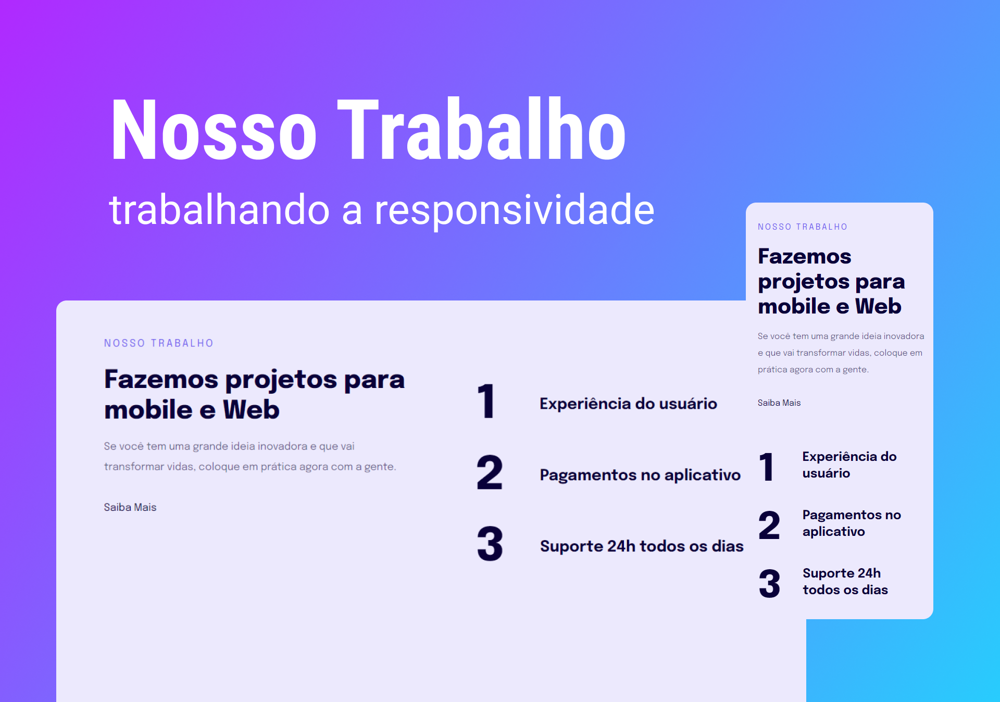

<h1 align="center"> Nosso trabalho </h1>

Projeto desenvolvido no stage 3 do programa Explorer da RocketSeat.  

  <a href="#-tecnologias">Tecnologias</a>&nbsp;&nbsp;&nbsp;|&nbsp;&nbsp;&nbsp;
  <a href="#-projeto">Projeto</a>&nbsp;&nbsp;&nbsp;|&nbsp;&nbsp;&nbsp;
  <a href="#-layout">Layout</a>&nbsp;&nbsp;&nbsp;|&nbsp;&nbsp;&nbsp;
  <a href="#memo-licença">Licença</a>

  

 

  

## 🚀 Tecnologias

Esse projeto foi desenvolvido com as seguintes tecnologias:

- HTML
- CSS
- Git e Github
- Figma

## 💻 Projeto

Esse projeto é uma page que trabalha com a responsividade no css, onde o usuário poderá abrir este page em um desktop ou mobile.

- [Acesse o projeto finalizado, online](https://jhgomess.github.io/Nosso-trabalho/)

## 🔖 Layout

Você pode visualizar o layout do projeto através [DESSE LINK](<https://www.figma.com/file/Vec6xjX2Y0UewovanuWh9X/Explorer-Stage-03-Projeto-02-(Copy)?type=design&node-id=203-412&mode=design&t=lalfMLnGKTzmHOWR-0>). É necessário ter conta no [Figma](https://figma.com) para acessá-lo.

## :memo: Licença

Esse projeto está sob a licença MIT.

---

Feito com ♥ by Rocketseat :wave: [Participe da nossa comunidade!](https://discord.gg/rocketseat)tseat
